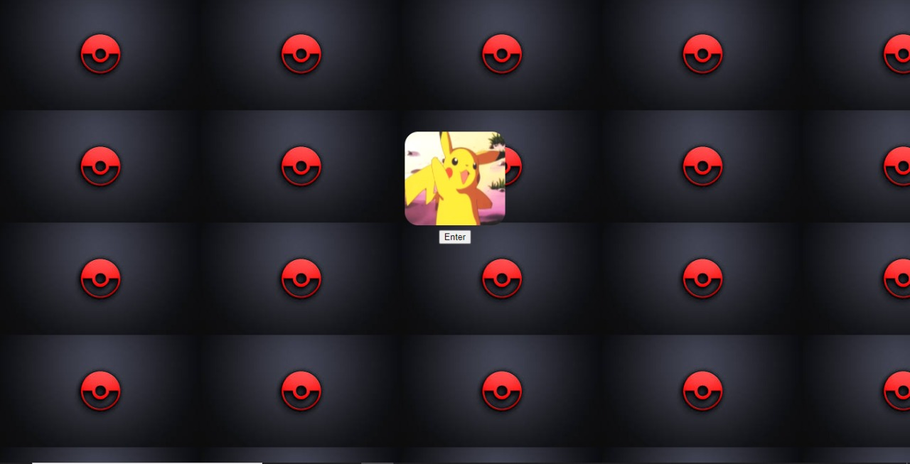
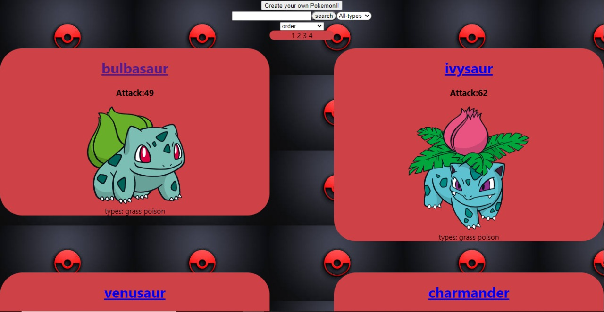
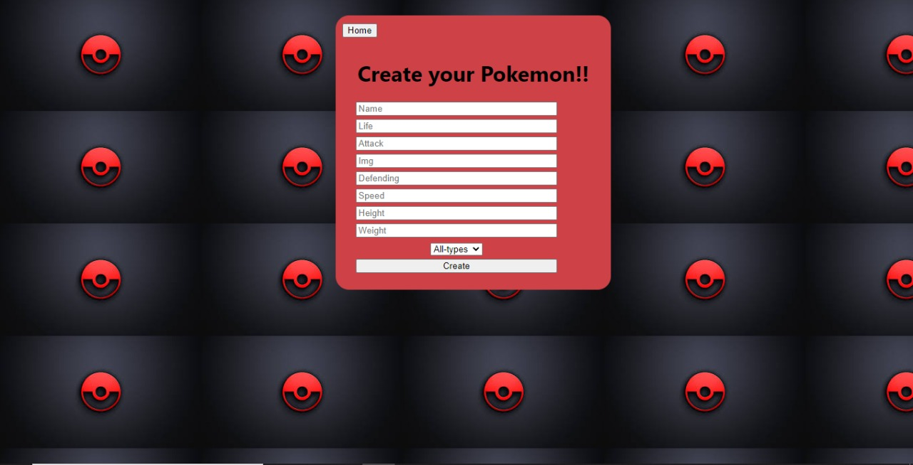

#### Soy un Full Stack Developer que esta sumando experiencia en desarrollo de aplicaciones Front-End y Back-End
#### busco seguir ampliando mis conocimientos asi sea en un equipo o de manera autodidacta 
#### para poder plasmarlo en un escenario real de trabajo.

---

## Contactame:

[Linkedin](https://www.linkedin.com/in/leonardo-s%C3%A1nchez-603648210/)

---

## Mi Stack de tecnologias:

- JavaScript
- HTML
- CSS
- React
- Angular (en proceso)
- Node.Js
- php (en proceso)
- SQL (PDO)

---

## Proyecto Individual Full Stack realizado

#### LANDING PAGE:

---

#### MAIN PAGE:

## 

---

#### DETAIL PAGE:

---

#### CREATEPOKEMON PAGE:

